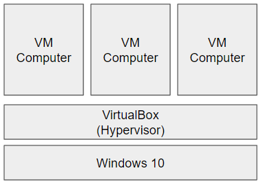

# 설치하려면 뭐가 필요해?
#### 컴퓨터랑 도커 프로그램

1. 컴퓨터 
cpu 2core, memory 2GB 이상 (도커 + 쿠버네티스)
사양확인 하기 : 실행(windows키+R) -> dxdiag
2. 운영체제(리눅스 또는 Windows 등)
3. 도커 설치
4. 도커 서비스 실행

#### 실습으로 따라하는 도커설치
1. VirtualBox설치 - 네트워크 구성 - VM(가상머신) 만들기

2. VM에 Ubuntu 20.04 설치하고 기본 환경구성하기
3. VM에 CentOS 설치하고 기본 환경 구성하기
4. Ubuntu / CentOS Server에 Docker 설치하기
5. Windows 10에 DockerDesktop 설치하기